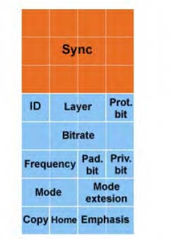

In a [previous post](../what-i-learned-about-mp3-encoding), I gave an introduction to my experience messing around with MP3 encoding algorithms. It was light on practical details and focused more on the history and challenges of MP3 encoding.

These posts hope to be more technical digest of the encoding algorithm.

## It starts with a sound wave
Like most (all?) algorithms, there is an input, and in MP3 encoding, that input begins as an analog sound wave. This wave needs to be translated to digital data, from a continuous data series to a discrete one. Similar to how enough small straight lines may be drawn to approximate a circle, audio-to-digital converters focus on taking many data points to reconstruct a facsimile of the real thing.

With sound, the most popular approach records the amplitude (if you forgot, that's the height of the wave) many times over a uniform period. That's enough information to fake the sound wave in digital players. The technical term for this process is [Pulse-code Modulation](https://www.wikiwand.com/en/Pulse-code_modulation).

<figure style="text-align: center">
    

        
    

    <figcaption><em>(From Wikipedia) The signal (red) is recorded at each regular points (blue).</em></figcaption>
</figure>

> Quick vocab moment
>
> The number of data points taken are called **Samples**. The accuracy of the amplitude value that is recorded (15 vs. 15.12849) is referred to as the **Bit Depth**. Furthermore, most signal processing algorithms won't record arbitrary values for each data point but instead "snap" them to a nearby, pre-determined value. For example, it may have "snapping" values of 16, 16.5, and 17 and when a data point comes in measuring 16.23, it gets recorded as 16. This general process is called **Quantization**.

So if we take a few moments to consider what it would take to record the best quality digital sound, we find increasing the Samples and Bit Depth will help. However, that means the digital audio data will be literally larger and more expensive to store, transfer, and perform computations on. Like the ones needed to play it.

For a real world example, Compact Disc Digital Audio (CD-DA) is the format that audio waves are encoded for CDs. That format records data points 44,100 times per second with a 16-bit depth (meaning data points can be stored with accuracy to ~15 decimal points).

Fortunately, the brain is fantastic at "filling in the blanks" so we only need to record enough data and sound waves will sonically coherent. Thus we enter the arena of lossy audio encodings, where algorithms duke it out to optimize and make trade-offs around the problem space of efficient storage of sound while maintaining acoustic fidelity.

The 90s ushered in the Age of the Internet and with it, an interest in transferring audio over the wire. Several encodings were developed and the historical winner was MP3, hitting a sweet spot in terms of storage size and sound quality. In more recent years, formats like [Opus](https://www.wikiwand.com/en/Opus_(codec)) provide a better lossy encoding format.

TODO:
- Define PCM up above more.
- Work on intro flow a bit more:
    - Analog to digital
    - Sharing digital, better encoders
    - Digital encoding basics and definitions
    - MP3 file format

## Background
Out of all the different frequency waves that exist out there, humans can only perceive a small range of them (getting smaller as we age). Sounds at the edge of range are harder to hear, with midrange frequencies being perceived as louder. Perceptual encoders take into account how sound is perceived when processing them.

Experiments show that the human ear breaks sound down into 24 frequency bands. Sounds in these so-called critical bands are harder to distinguish from each other. If there is a loud sound in one of these bands, other sounds can be ignored and rendered inaudible. Such sounds are said to be masked, specifically, *simultaneous masking*. Another type of masking happens temporally when a loud tonal component covers up a weaker one, and 50ms before/300ms after there are residual masking effects.

The International Organization for Standardization (ISO) created a working group in the late 80s to find a better audio encoder. This group, the Moving Pictures Experts Group (MPEG), codified the work done by the Fraunhofer Institute, who developed algorithms for video and audio compression. The audio work involved 3 techniques, of increasing complexity, that could create quality sound encodings. MPEG Layer 3, or MP3, is the most complex and produces the best sound of the three.

| Encoding | Compression | Bitrate
| --- | --- | --- |
| PCM CD Quality | 1:1 | 1.4 Mpbs
| Layer I | 4:1 | 384 kpbs
| Layer II | 8:1 | 192 kpbs
| Layer III | 12:1 | 128 kpbs

As seen, MP3 encoding can compress audio by a fact of 12! And with it's decent bitrate, it still sounds unnoticeably different to most listeners.

> Vocab!
>
> **Bitrate** is the amount of data stored for every second of uncompressed audio. This number is normally given to encoders to tell them how quality the encoded stream will sound. Layer III supports 8-320 kpbs bitrate, default is usually 128.

When dealing with bitrates, some MP3 encoders get smart. Instead of taking a constant bitrate (CBR) over the entire signal, higher bitrates are used in portions of the signal that are complex (maybe lots of instruments are playing) and lower bitrates elsewhere. This variable bitrate (VBR) can improve quality at the expense of algorithmic complexity.

## MP3 File Layout
The successful MP3 encoder will produce a well-formatted file that decoders can understand.

### Frames
An MP3 file is composed of one or more **Frames**, a small section of the audio data. In MP3, 1152 samples are stored in every frame. For better perceptual analysis, Frames are split in half into **Granules** (thus each granule contains 576 samples). The size of any given frame depends on the bitrate (bigger samples) and sampling frequency (more samples). If not enough samples will fill up a frame, **Padding** bits are added.

Structurally, the frame has five parts:
| Header | CRC | Side Information | Main Data | Ancillary Data |
| --- | --- | --- | --- | --- |

#### Header
Many files use the idea of a Header, a few bits specifically set at the beginning of the file, to let consuming programs know what type of file it is. While MP3 files don't have a main file header, each frame does and the first important item it contains is the **Sync Word**. This allows MP3 players to find and play from any specific point in the file. When consuming MP3 over a broadcast, receivers only need to find the sync word to tune in.

Here's a full description of the header data:

<figure style="text-align: center">
    

        
    

    <figcaption><em>MP3 frame header</em></figcaption>
</figure>

- Sync Word (12 bits)
- ID (1 bit): MPEG Version. If set, use MPEG-1, else MPEG-2
    - Sometimes, 11 bits are used for the Sync Word and the ID uses 2 bits:
        | Value | MPEG Version |
        |- |- |
        | 00 | MPEG-2.5
        | 01 | Reserved
        | 10 | MPEG-2
        | 11 | MPEG-1
- Layer (2 bits): The encoding complexity used:
        | Value | Layer |
        |- |- |
        | 00 | Reserved
        | 01 | Layer III
        | 10 | Layer II
        | 11 | Layer I
- Protection (1 bit): Use [cyclic redundancy checks (CRC)](https://www.wikiwand.com/en/Cyclic_redundancy_check) to see if frame has been altered during transmission
- Bitrate (4 bits): Tell the decoder the bitrate used during encoding. Depending on the MPEG Version and Layer used, this can vary from 8 to 448 kpbs
- Frequency (2 bits): The sampling frequency used. Each MPEG Version has a few valid values.
- Padding (1 bit): As discussed above, set if needed to meet the specified bitrate. To illustrate the point, if using a bitrate of 128 kbps and sampling frequency of 44100 Hz, frames will end up being 417 bytes. To meet the bitrate requirement, some frames need to be 418 bytes. They will use the padding bit.
- Private (1 bit): Allow for application-specific triggers
- Mode (2 bits): The audio Channel mode:
        | Value | Mode |
        |- |- |
        | 00 | Stereo
        | 01 | Joint Stereo
        | 10 | Dual Channel
        | 11 | Single Channel
- Mode Extension (2 bit): If the mode is Joint Stereo, this specifies what type of stereo (Intensity, MS, or both), if applicable.
    > TODO: Explain channels and stereo stuff
- Copyright (1 bit): This audio is legally protected by copyright
- Home a.k.a  Original Bit (1 bit): If set, this frame is on the original media
- Emphasis (2 bits): Indicate if the decoder needs to worry about undoing any Emphasis that was applied to the signal. Emphasis is used to boost or attenuate certain parts of the signal so it sounds better.

#### CRC
If the protection bit is set in the Header, these 16 bytes of the frame are used to check certain data in the frame for validation. The sensitive data is specifically bit 16-31 from the header and side info.

#### Side Information
This part of the frame contains metadata needed to decode the main data. The content of the Side Info depend on the Channel mode used  The side info has this format:
| Main Data Begin | Private Bits | scfsi | Granule 1 Side Info | Granule 1 Side Info |
| --- | --- | --- | --- | --- |

- Main Data Begin:
