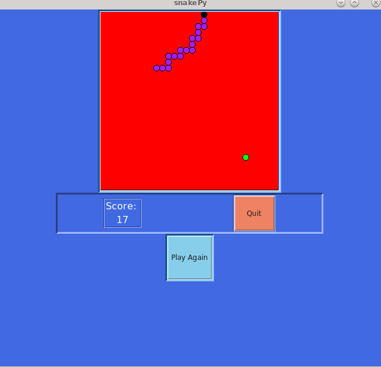
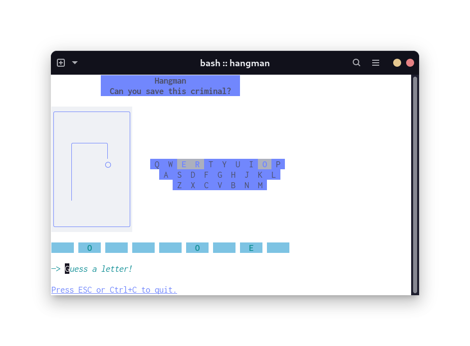
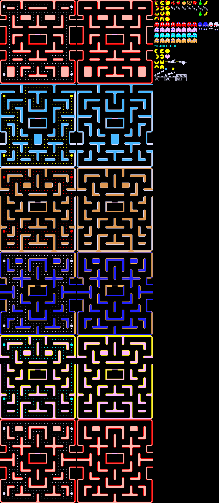
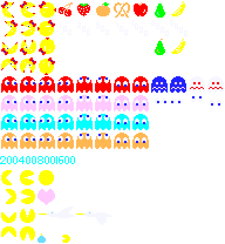
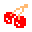
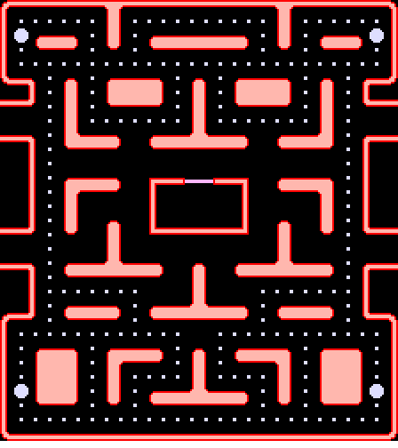
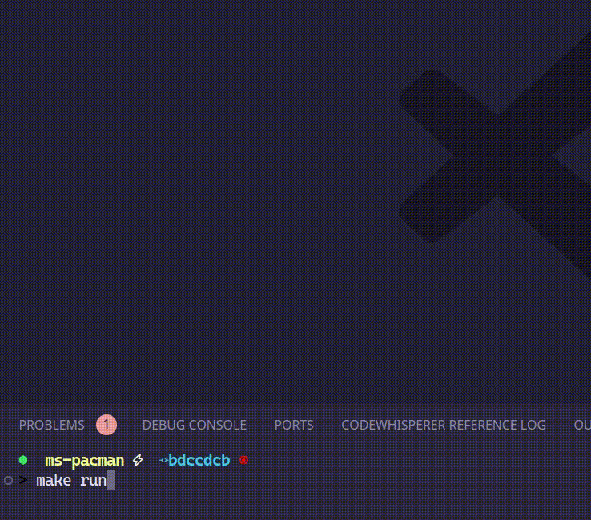

## A New Project
I play lots of video games, mostly on the Switch. And this is mostly a programming blog, so I must like that too. I should especially like combining these two.

The obvious overlap is programming a game. I've made a couple small toy games:
- [Snake](https://github.com/braheezy/snakePy)

- [Hangman](https://github.com/braheezy/hangman)


In both cases though, the game just happened to be the *type* of application I was writing. For Snake, it was my first GUI-from-scratch project and [Tkinter](https://www.wikiwand.com/en/Tkinter) graphics were the focus. For Hangman, it was my first non-trivial TUI and TUIs in general (plus the framework I used, [bubbletea](https://github.com/charmbracelet/bubbletea)) were the focus.

I decided it was time for a project where the game *itself* was the focus. Something more complex than my previous projects but not too complex ;) and I am not a creative person, so copying an existing game felt like the best route. I leafed through some old arcade games and existing projects on GitHub. I almost did Space Invaders, then started liking the idea of Pac-Man, then noticed the lack of love for Ms. Pac-Man in hobby ports. Behind every great man is an even greater women so...

## My, My, Ms. Pac-Man
Having landed on a palatable project idea (not all are!), I needed to figure out my high-level approach. What tools? What would my Ms. Pac-Man game look and feel like?

- **Language**: Go, my new language love
    - Most games are built using a **Game Engine**. My quick trade study showed [ebiten](https://ebitengine.org/) to be a solid choice for Go.
- **Look**: I am no artist. I tried drawing Pacman in a pixel editor one night and disliked the process and what I made. I could programmatically draw things but that's a lot of work too. It's an old enough game. Could I just use the original assets?
- **Sound**: Yes, there should be sound.
- **Behavior**: Let's reproduce, as faithfully as possible, the original game logic.

So, I'll be setting out to make as close a clone to the original Ms. Pac-Man as I can. Along the way, I plan to make tons of errors. I'll probably do everything the hard way until I discover the right approach to use. There will be things I will be stuck on for weeks that a high-level game engine like Godot or Unity makes trivial. Such is the journey.

## The First Steps: Research
Blank IDE in front of me, it was time to take the first step...

Which was close the IDE and open a web browser because I needed more materials before I got started, like:
- Original art assets, including sprites and levels
- Original sound effects
- Original game logic

Everyone in the Pac-Man family is really popular so it was easy to find stuff:
- This [sprite sheet](https://www.spriters-resource.com/arcade/mspacman/sheet/21043/) contains every graphic used.
- The [zip file hosted here](https://www.sounds-resource.com/arcade/mspacman/sound/16742/) contains all sounds effects as separate WAV files.[^2]
- Extensive articles on game logic[^1]:
    - [The Pac-Man Dossier](https://www.gamedeveloper.com/design/the-pac-man-dossier)
    - [Understanding Pac-Man Ghost Behavior](https://gameinternals.com/understanding-pac-man-ghost-behavior)

This was enough fruit to get juicing with.

## The First Squeeze: Representing a Level
Back in front of the IDE, it seemed to me the first thing I should try to do is draw a level. This would introduce the basics of the game engine and get something satisfying on the screen. It was at this point I also started thinking about how the player sprite would move and interact with the level. This all led me to settle on a tile-based approach.



I need tiles of the levels but all I had was one big PNG file. I also need individual sprites dissected from this sheet.

### Slicing and Dicing
I started with the easier operation: splitting the sprites into individual PNG files. I used Krita, an open-source graphics editor, to cut all characters into a separate PNG:



I then wrote a script with ChatGPT that would take this image and split it even further. It starts at the top left corner and, knowing that each sprite is the same size (32x32 pixels in this case), it uses ImageMagick's [`convert`](https://imagemagick.org/script/convert.php) command and math(!) to walk the file sprite-by-sprite, row-by-row, and slice them into separate files. The files the script creates need to be named *something* so I made a list of names that are chosen as the chunks are split. For example, the 4th sprite in the picture above is a cherry, so "cherry" is the 4th name in the list.

<div style="text-align: center">
    
    
    
    
</div>

A very similar approach soon had the first level in 16x16 pixel tile pieces. So this:



Was broken down into pieces like this:
<figure style="text-align: center">
    <div>
        
        
        
    </div>
    <figcaption><em>Wall Left</em>, <em>Wall Upper Left Corner: Inner</em>, and <em>Pellet</em> tile</figcaption>
</figure>

The careful reader will note the sprites are twice the size of the tiles for the level. Another note on size: the original PNG tile sheet used 8x8 pixel tiles for the level but that size was comically small on modern HD displays so I doubled the PNG resolution before doing all this.

### Putting the Pieces Back Together
Now that I had a bunch of tiles, I needed to load them in the game engine and stich them back together in the correct order to make a coherent level. I do this by "drawing" the level in Unicode in a text file. By taking advantage of the vertical symmetry of the level, I only need to "draw" half the level and can use maths to render the rest.

For example, here's the Unicode representing most of the top left quadrant:

    ⌜------⎤⎡-----
    ⎸••••••][•••••
    ⎸⦾⌌⎽⎽⌍•][•⌌⎽⎽⎽
    ⎸•⌎⎺⎺⌏•⌎⌏•⌎⎺⎺⎺
    ⎸•••••••••••••
    ⌞_⌍•⌌⌍•⌌⎽⎽⎽⌍•⌌
    ⎸•][•]▓▓▓[•]
    --⌏•][•⌎⎺⎺⎺⌏•]
    •][•••••••]
    __⌍•]⎩⎽⎽⌍ ⌌⎽⎽⎭
    ⎸•⌎⎺⎺⎺⌏ ⌎⎺⎺⎺
    ⎸•
    ⎸•⌌⎽⎽⎽⌍ 「_>*
    ⎸•]⎧⎺⎺⌏ ⎹

In my asset loading code, I maintain a mapping of Unicode symbols to file name:

```go
var tileLookup = map[rune]string{
	'⌜': "W_ULcorner_thin",
	'⌞': "W_DLcorner_thin",
	'-': "W_U",
	'_': "W_D",
	'⎡': "W_ULcorner_thick",
	'⎤': "W_URcorner_thick",
	'⎸': "W_L",
	'⎹': "W_R",
	'•': "pellet",
```
It's useful for the game to know what type of tile it may be dealing with because a lot of decisions can be made by asking the question "Is this tile a wall?". My naming scheme for level tile files let me do something cheesy where I set the tile type by checking the text in the file name:
```go
switch tileName {
case "blank":
    tileType = TileTypeBlank
case "gate":
    tileType = TileTypeGate
case "pellet":
    tileType = TileTypePellet
case "power_pellet":
    tileType = TileTypePowerPellet
default:
    tileType = TileTypeWall
}
```

To summarize, in order to load a level from tiles, the algorithm does this:
- Load from disk the Unicode text file that defines the level layout.
- For each Unicode character in the layout file, use the Unicode name map to load the appropriate tile
- Draw the tile file at the correct location, determined by the order the tile is loaded
- Mirror the tile across the Y-axis and draw it again
- Give the final image to Ebiten to draw

And here's the final result of that operation:



The game engine code for all this is tiny (for now):
```go
// This function starts the game loop
func main() {
	ebiten.SetWindowSize(game.Config.Width, game.Config.Height)
	ebiten.SetWindowTitle("Ms. Pacman")

    // Load all the tiles from disk and stich together the first level.
    // This is where the algorithm I describe above is implemented.
	img, err := assets.CreateLevelImage("level1")
	if err != nil {
		panic(err)
	}

	if err := ebiten.RunGame(&game.Game{CurrentLevelImage: img}); err != nil {
		log.Fatal(err)
	}
}

// This is then called every frame and draws the level image
func (g *Game) Draw(screen *ebiten.Image) {
	screen.DrawImage(g.CurrentLevelImage, &ebiten.DrawImageOptions{})
}
```

And that's enough progress for this post! Next time, I want to get Ms. Pac-Man on the screen and maybe move her around a bit.


[^1]: Yes, these are both Pac-Man references, not Ms. Pac-Man. As far as my research can tell, they implement identical game logic.
[^2]: Check out this sweet tune from the intro:

    
