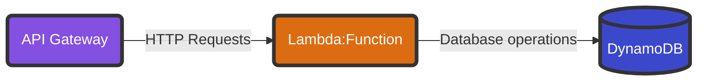

---
categories:
- Guides
date: "2023-05-24T02:29:34Z"
tags:
- Cloud
- Education
title: My Cloudy Resume
---
# A Cloudy Challenge
I can't remember where I originally found the link but there's a [website that challenges](https://cloudresumechallenge.dev/) aspiring cloud engineers to host a publicly accessible HTML version of their resume on a cloud platform. The website outlines high-level steps on how to accomplish this, including steps tailored to popular cloud platforms. As someone always looking to expand my portfolio, I eagerly embraced this opportunity.

Indeed, it turned out to be an excellent experience! You can check out my final resume hosted on AWS [here](https://resume.braheezy.net).

This blog post aims to chronicle my journey in completing this challenge. Throughout the post, I will highlight interesting aspects and obstacles I encountered along the way. While I won't provide a comprehensive tutorial, as the challenge is meant to be a learning process, I might share enough information to offer some guidance if you find yourself stuck in your own cloud resume challenge.


# Das Code
If you just want to see the code, look no further:
- https://github.com/braheezy-resume: The GitHub Organization I established to house all the projects for this effort.
    - [cloudy-resume](https://github.com/braheezy-resume/cloudy-resume): The "resume-as-code" project. I make edits to the resume in Markdown (my preferred markup language), push the results to GitHub, and voilà! The resume website is automatically updated with my latest accomplishments.
    - [resumerk](https://github.com/braheezy-resume/resumerk): A poorly named Go project I wrote to convert Markdown files into HTML and PDF formats.
    - [terraresume](https://github.com/braheezy-resume/terraresume): The Terraform project that deploys the entire AWS infrastructure powering the cloudy resume.
    - [resume-analytics](https://github.com/braheezy-resume/resume-analytics): Additional Go code I wrote to collect metrics (e.g. visitor count) about the website.

# Rules and Regulations
To begin my project, I acquired the [specific steps for AWS](https://cloudresumechallenge.dev/docs/the-challenge/aws/)—my chosen cloud provider—and condensed them into a handy checklist to guide me:

- **Certification**: The resume must showcase the AWS Cloud Practitioner certification.
- **HTML**: The resume needs to be written in HTML.
- **CSS**: The resume needs to be styled with CSS.
- **Static Website**: Deploy the resume as an Amazon S3 static website.
- **HTTPS**: The S3 website URL should use HTTPS for enhanced security.
- **DNS**: Associate a custom DNS domain name with the website.
- **JavaScript**: The resume webpage should include a visitor counter that displays how many people have accessed the site. Write a bit of JavaScript to make this happen.
- **Database**: Set up a database to store and update the visitor counter.
- **API**: Avoid direct communication between the JavaScript code and the database. Instead, create an API that handles requests from the resume and communicates with the database.
- **Go**: Write Go code to process the API requests.
- **Tests**: Include tests for the written code.
- **Infrastructure as Code**: Utilize Terraform to manage the cloud resources, rather than relying solely on the AWS Management Console.
- **Source Control**: Create a GitHub repository for the backend code.
- **CI/CD (Back end)**: Employ GitHub Actions for continuous integration and deployment of the backend code.
- **CI/CD (Front end)**: Utilize GitHub Actions for continuous integration and deployment of the resume and its code.
- **Blog post**: Document the journey.

Yes, right now you are enjoying the last part of the challenge: this blog post!

Given that the 13th item on the list is Source Control, I don't think this was written for people with software engineering experience. Consequently, I didn't solve these "in order" e.g. all projects used Source Control and CI/CD from the beginning.

# AWS Cloud Practitioner Certification
I actually did do this one first. The entry level certificate proving AWS knowledge is the [Cloud Practitioner Certification](https://aws.amazon.com/certification/certified-cloud-practitioner/). It validates one's knowledge of AWS and requires familiarity with common AWS services. It also covers topics such as AWS pricing and the dynamics of the relationship between cloud engineers and cloud providers.

To prepare for the certification, I enrolled in a course on one of the Massive Open Online Course (MOOC) platforms, experimented with free AWS services, and repeatedly took practice exams. Once I consistently achieved passing scores, I knew I was ready. During a winter break, I took the remote proctored exam and obtained the certification. Being a software engineer already proved advantageous as I had prior exposure to technical aspects like APIs and selecting appropriate database types for different scenarios.

Overall, the experience was highly rewarding, and it bolstered my confidence in discussing and contemplating cloud-related computing concepts.

# HTML/CSS Resume
Maintaining a resume in HTML is actually great advice that everybody should do regardless of field. My old method of using an invisible table to line up content feels archaic now. Compared to traditional word processing documents, HTML provides greater flexibility and ease of styling. These days, web browsers make it effortless to convert HTML to PDF, which is often a requirement for submitting job applications.

I didn't really want to write raw HTML when I'm trying to focus on my resume content. My preferred markup language is [Markdown](https://www.wikiwand.com/en/Markdown) which is not directly compatible with static websites or PDF submissions. After rewriting my resume in Markdown, I faced my first real challenge: converting Markdown to HTML and PDF.

Converting Markdown to HTML is a trivial task since Markdown is designed to convert seamlessly to valid HTML. Many popular programming languages offer libraries or bindings for this purpose:

**Python**
```python
import markdown

md_text = "# Heading\n\nThis is some **bold** and *italic* text."

html_text = markdown.markdown(md_text)

print(html_text)
```

**JavaScript**
```javascript
import marked from 'marked';

const mdText = "# Heading\n\nThis is some **bold** and *italic* text.";

const htmlText = marked(mdText);

console.log(htmlText);
```

**Rust**
```rust
extern crate pulldown_cmark;

use pulldown_cmark::{html, Parser};

fn main() {
    let md_text = "# Heading\n\nThis is some **bold** and *italic* text.";

    let mut html_text = String::new();
    html::push_html(&mut html_text, Parser::new(&md_text));

    println!("{}", html_text);
}
```

All of these simple examples produce the following output:
```console
<h1>Heading</h1>
<p>This is some <strong>bold</strong> and <em>italic</em> text.</p>
```

From there, I can open the local HTML file in a  web browser and use the built-in tools to print the page to PDF. I pat myself heartily on the back, "Congratulations! You converted a Markdown file to HTML and PDF". But this is a fairly manual process and I need it to be quicker.

## Resumerk
I desired a program that could take my `resume.md` file as input and in return, produce `resume.html` and `resume.pdf` files, ensuring the content remained consistent across all formats.

Writing software is expensive and I'm always willing to integrate a third party tool if it works. I was using [this project](https://github.com/mikepqr/resume.md) from `mikepqr` but I wanted to pad my portfolio with another programming project. At this point, I had seen a fair amount of resume convertor projects on GitHub, written in Python and Go, and all of them required 3rd party tools installed to do the job. I recently started to [learn more about Go](), a great language for [static binaries](https://www.wikiwand.com/en/Static_build), and decided I would try my hand at a dependency-less resume convertor.

As I mentioned earlier, converting Markdown to HTML is easy and Go was no different. `gomarkdown/markdown` provides a pure Go library to make this simple:
```go
import (
	"os"
	"github.com/gomarkdown/markdown"
	"github.com/gomarkdown/markdown/html"
	"github.com/gomarkdown/markdown/parser"
)
func writeMdToHtml(markdownFile string) {
    // Read the Markdown file into the program
    mdData, _ := os.ReadFile(markdownFile)
    // Force all line endings to Unix line endings
    mdData = markdown.NormalizeNewlines(mdData)
    // Enable extra Markdown features when parsing
    // CommonExtensions: Sane defaults expected in most Markdown docs
    // AutoHeadingIDs: Create the heading ID from the text
    extensions := parser.CommonExtensions | parser.AutoHeadingIDs
    // Define the parser
    p := parser.NewWithExtensions(extensions)

    // Run the parser on the Markdown data, generating the AST,
    // an abstract representation of the information
    doc := p.Parse(mdData)

    // Similar to the parser, setup a renderer with certain features (flags) enabled
    htmlFlags := html.CommonFlags | html.HrefTargetBlank
    opts := html.RendererOptions{Flags: htmlFlags}
    renderer := html.NewRenderer(opts)

    // Turn the AST into HTML
    html := markdown.Render(doc, renderer)
}
```

So HTML is covered. Next is to convert it to PDF and this is where most projects start to rely on third-party CLI tools. Those projects won't run unless extra software is installed. Here's what most of them were depending on:
- [`pandoc`](https://pandoc.org/): The self-proclaimed universal document convertor. It's a Haskell library that's also built as a binary for distribution.
- [`wkhtmltopdf`](https://wkhtmltopdf.org/): Another project that uses the Qt WebKit rendering engine perform conversions. Comes with a C library or a binary.
- [Headless Chrome](https://developer.chrome.com/blog/headless-chrome/): Still using a web browser to do the conversion but running it GUI-less from the command line.

Chrome, being the most modern of the three, comes with a pure Go implementation of running Chrome on the command line in the `chromedp` library. I use that package:

```go
import (
	"github.com/chromedp/cdproto/page"
	"github.com/chromedp/chromedp"
)
func writeHtmlToPdf(htmlFile string, pdfFile string) {
	// create context
	ctx, cancel := chromedp.NewContext(context.Background())
	defer cancel()

	// capture pdf
	var buf []byte
	if err := chromedp.Run(ctx, printToPDF(fmt.Sprintf("file://%v", htmlFile), &buf)); err != nil {
		log.Fatal(err)
	}

	if err := os.WriteFile(pdfFile, buf, 0644); err != nil {
		log.Fatal(err)
	}
}

// print a specific pdf page.
func printToPDF(url string, res *[]byte) chromedp.Tasks {
	return chromedp.Tasks{
		chromedp.Navigate(url),
		chromedp.ActionFunc(func(ctx context.Context) error {
			buf, _, err := page.PrintToPDF().WithPrintBackground(false).Do(ctx)
			if err != nil {
				return err
			}
			*res = buf
			return nil
		}),
	}
}
```

With this core logic in place, I had an initial version of `resumerk` up and running. It allowed me to convert Markdown files into HTML and PDF using a single binary and without any system dependencies. Nice!

Subsequently, I added the ability to inject custom CSS and JavaScript into the HTML file, enabling rich styling and dynamic content. I achieved this by utilizing a Go Template for generating the desired HTML file:


```go

const htmlTemplate = `
<!DOCTYPE html>
<html lang="en">
    <head>
        <meta charset="UTF-8">
        <title>{{.Title}}</title>
        <script>
{{.JSContent}}
        </script>
        <style>
{{.CSSContent}}
        </style>
    </head>
    <body>
        <div id="resume">
            {{.Resume}}
        </div>
    </body>
</html>`

```

CSS and JS files can be provided and their content will replace the variables `CSSContent` and `JSContent` in the template, respectively. The converted resume HTML content, which on its own does not constitute a complete HTML webpage document, replaces the `Resume` variable within the `<body>` element. After adding a few convenience features, `resumerk` was nearly feature complete and passing all unit tests.

For building and releasing the project, I have [`Makefile`s](https://www.tutorialspoint.com/makefile/why_makefile.htm) and [GoReleaser](https://goreleaser.com/) configs that I copy/paste for Go projects and edit as needed. These tools provided the following benefits:
- Simplified build commands that remain consistent, such as `make build`.
- Cross-compiled binaries right from the start of the project.
- Automatic creation of GitHub releases, requiring minimal manual intervention.

I incorporated [GitHub workflows](https://docs.github.com/en/actions/using-workflows/about-workflows) that trigger builds and tests for `resumerk` as I make updates to the program. When new tags are created, a Release is automatically created in GitHub and the program is distributed from there in an archive format.


## Resume as Code
In a "Resume as Code" paradigm, the resume is treated as software engineers treat code. Here's how I implemented it:
- *Source control*: I track changes made to my resume over time using GitHub.
- *Testing*: I ensure that spelling, grammar, and formatting are correct by utilizing a third-party GitHub action called [crate-ci/typos](https://github.com/crate-ci/typos).
- *Building*: The edited resume is converted to different formats using `resumerk`.
- *Deployment*: The version of my resume that's saved to the GitHub repository is automatically deployed to AWS (as HTML) and is also made available as a GitHub Release.

All of the above actions are automatically applied by GitHub workflows. I edit my resume on my local computer in Markdown, push the change to the GitHub repository, and the HTML website eventually updates.


# Static Website
A static website is the simplest type of web deployment. It involves placing web files (e.g. HTML, CSS, JS) in a specific location and configuring a web server to serve the HTML file when requested. Unlike dynamic websites, there is no backend server generating additional web content that the viewer needs to download. To update a static website, the owner simply needs to modify the existing files. In the case of a resume, serving a single `resume.html` file is an ideal use case for a static website.

AWS offers a storage service called **Simple Storage Service** (S3) that allows you to store files. Hosting static websites is such a common activity that S3 includes built-in support for hosting static websites, and a comprehensive [guide](https://docs.aws.amazon.com/AmazonS3/latest/userguide/WebsiteHosting.html) showing everything that needs to be done.

When working with AWS services for an extended period or involving multiple services, I prefer not to rely on the AWS Management Console website to manage the infrastructure. It's crucial to have the ability to tear down everything if needed. Careless clicks in the Management Console can inadvertently lead to substantial expenses, and leveraging the free tier is always a good practice.

Enter [Terraform](https://www.terraform.io/): the programmatic way of defining cloud infrastructure. By filling out a configuration file and running the `terraform` program, you can do nearly everything the Management Console allows.

For example, S3 has what they call "buckets" where you store files. In the Management Console, you navigate to S3 service, click through the "Create bucket" button, and fill out a form.

In Terraform, you could do this:

```hcl
resource "aws_s3_bucket" "example" {
  bucket = "my-bucket"
}
```

Putting a file in an S3 bucket does not a static website make. Users would have to visit the insecure, autogenerated URL for your bucket directly. It would be best if users can just go to `my-resume.com` or something similar.

## DNS, CDN, HTTPS, and More Acronyms
If you want to serve a webpage at a custom name that you pick, you need to fork over cash to those that dole out domain names. They will provide you with access to a domain and records that you can use to prove to the rest of the world that the domain is indeed yours. AWS provides the `Route 53` service for domain management. There, I bought a domain `braheezy.net` and yes, this was a manual task I did while building the infrastructure. One should be careful combining automation and actions that cost money.

Now that I could assign an easy-to-share name as the S3 bucket URL, I had another problem at hand: scalability. Surely a in-demand engineer like myself will garner hundreds and thousands of visitors to my resume website, right? Right?? I doubt S3, a storage solution, is optimized to handle many concurrent read requests (okay fair point, I wouldn't actually be hitting [the limit](https://docs.aws.amazon.com/AmazonS3/latest/userguide/optimizing-performance.html). Maybe one day!). Additionally, the physical computer in the cloud that is storing the resume file is somewhere on the U.S. West Cost. European visitors may have a slow viewing experience. That won't do.

The modern solution to address these challenges is remarkably simple: create copies of the file and distribute them across computers closer to the users. As more users visit the site, more copies can be put on more computers. These computers, known as edge locations, facilitate quicker downloads due to their proximity to the users. This simplified explanation describes a Content Delivery Network (CDN), which is another service offered by AWS known as **CloudFront**.

Upon configuration, CloudFront serves the files specified (in this case, the S3 bucket I told it about) to edge locations. Similar to S3, CloudFront generates an auto-generated URL that, when used, will route users to the closest copy of the website. So it's not the S3 bucket URL that should be replaced with a custom domain name, it's this CloudFront URL.

So far, everything appears to be progressing well: implement CDN technology to serve the resume file from a bucket and replace the URL with the custom domain name. I quickly get that working but my browser is complaining about untrusted certificates when visiting the site. Oh yeah, what about HTTPS?

### The Troubles with TLS
Modern web browsers often display warnings to users when visiting an HTTP website, potentially discouraging visitors from enjoying your content. To avoid this issue, support for HTTPS is essential and Transport Layer Security (TLS) is a critical component secure HTTPS.

At the core of TLS is the exchange of cryptographic certificate files. These are files containing random letters and numbers and when certain types of arcane maths are performed on those random letters and numbers, interesting outcomes happen. Smart mathematicians and computer scientists used these interesting outcomes to create systems that allow for communication safe from prying eyes.

The intricate cryptographic details that go into these interesting outcomes and safe communication systems can (and do) fill textbooks. When it comes to TLS and HTTPS, the basic concept involves the creation and trading of certificates. These certificates are placed on computers all over the world, and most network communication software is designed to check and verify these certificates. Certificates possess important attributes, like providing the ability to prove who signed the certificate and what it's for (e.g., Google signed it, and it is intended for `google.com`). As certificates are verified, they can be combined with other already-trusted certificates, forming a so-called "chain of trust." To ensure that my custom domain `braheezy.net` participates in this global certificate trust exchange, I need to generate certificates specifically for `braheezy.net`. But anyone with a computer can generate certificates. I also need a way to prove to the world that the certificates I generate were indeed generated by me, the owner of `braheezy.net`.

Another helpful AWS service in this regard is the **Amazon Certificate Manager** (ACM). They handle the generation of certificates, and since I purchased the domain from AWS, they provide a convenient method for verifying my ownership of the specified domain.

When you purchase a domain from Route 53 (or any domain name registrar), they update their servers with your domain information. Registrars operate the DNS servers used by the entire Internet, enabling the public resolution of your domain name by strangers. Route 53 specifically does this by assigning dedicated name servers to your domain (name servers are responsible for storing domain name relationships) that respond with your domain when queried.

Returning to the topic of certificates, one way to prove domain ownership is by placing a secret code on the assigned name servers (a privilege reserved for domain owners). I can then share the secret code and instruct someone to request it from the name server. If the name server responds with the correct code, it verifies my ownership. Here's an example exchange:

- **Me**: "If you ask the server for the special code, it will respond with 5."
- **You**: "Hey server, what's the secret code?"
- **Server**: "5"
- **You**: "Wow..."

Since Route 53 and ACM operate on the same Amazon infrastructure, they simplify this secret code exchange for you. Once the certificates are successfully generated and verified, they can be added to CloudFront, enabling visits to https://resume.braheezy.net without any warnings.

## A Simple Visitor Counter(?)
The goal: use JavaScript to display a number on the page that reflects how many unique users have visited the site. This seemingly simple problem statement quickly spiraled into the most complicated part of the website, a multi-faceted challenge spanning at least 5 different technology domains.

### To View, or Not, View the Count
Physically showing the count on the site means adding an HTML element. This is an element that should really only be in the HTML version of the resume because having it anywhere else makes no sense. There's a few different ways to solve this problem and I accidentally landed on a lazy solution that I recommend to no one.

I use JS to dynamically inject the visitor counter HTML element into the page. This happens after a network call lookup the count in a database and takes a moment to load in. This window of time is large enough that `resumerk` can open the page and convert it to PDF before the JS loads.

### When is a Visit a Visit?
The next challenge was to determine when to increment the visitor counter. Since the goal specifies *unique* visitors, my initial thought was to use IP addresses. However, considering that IP addresses are often dynamically assigned and can change, it might lead to counting multiple visits from the same user.

After conducting some research, I found a better solution using cookies. Cookies are small pieces of data that websites can store in a user's browser. By using a cookie to mark users as they visit, I can intelligently increment the counter only when a new user (one without the cookie) arrives. Here's an example implementation in JavaScript:

```javascript
// Read the current cookies
const userCookies = document.cookie
if (cookies) {
    console.log("user has already visited!")
} else {
    document.cookie = "visited=yes"
    incrementVisitorCounter()
}
```

### Remembering Visits
For this counter to work across multiple visitors, the count needs to be stored somewhere outside the website. This requires persistent storage that can be consulted for the latest count and incremented as necessary. In modern technology terms, this means storing the count in a database. So, I turned to AWS and a service called **DynamoDB**, which provides simple key-value storage.

To me, key-value storage implies a simple structure like `users: 10` and if that's all you need, that's literally all that's in the database. However, DynamoDB introduces the concept of a partition key used for managing scaling operations in the background. In applications where it makes sense, the partition key could be something meaningful like a userID. However, for this project, I wasn't sure what to use as the partition key. Perhaps it could make sense to have the key as `site` and the value as `braheezy.net`, allowing the table to support other websites (that I don't plan on creating).

Since I only wanted to store a single number, it turned out to be most effective to treat the count as an Attribute in the Table:

**DynamoDB Table**
| Property        | Value       |
|-----------------|-------------|
| Table Name      | site-analytics  |
| Partition Key   | metrics     |

**Attributes**
| Attribute       | Type        |
|-----------------|-------------|
| visitorCount    | Number      |

Now I have a `visitorCount` that my website can query and increment as needed.

### Interacting with DynamoDB
Although the JavaScript on the website is capable of directly making calls to the database, it is considered best practice to offload that processing task to another computer. This approach adds complexity to the website architecture, but it allows the frontend to focus solely on displaying the visitor count without concerning itself with how the count is saved.

This other computer, known as the backend server, will listen for requests to either retrieve the current count or increment it. It will then make calls to DynamoDB to read the `visitorCount` variable or update it. Finally, it will respond to the frontend with the result.

#### Processing Visitor Counts: APIs and Lambdas
As mentioned, the backend server listens for requests to perform tasks. This is accomplished using an API, which describes how programs interact with each other. AWS offers a service called **AWS API Gateway** specifically designed for providing HTTP APIs. It provides a URL and various API endpoints to handle different types of HTTP requests. In this project, I created the `/count` endpoint and configured different HTTP request methods to perform specific actions from the website using JavaScript calls:

**API Endpoints**
| Endpoint        | Request | Action |
|-----------------|---------|--- |
| `${API_URL}/count` | GET  | Retrieve the current visitor count
| `${API_URL}/count` | PUT  | Increment the current visitor count

The `$API_URL` is generated by AWS API Gateway and must be shared with the website frontend so it knows where to send requests.

Now that we have a way to listen for requests on another computer, we need a mechanism to actually do something and  process those requests. The AWS approach is to deploy software on yet another computer and configure AWS API Gateway to forward the requests to that computer. I developed a Go program that accepts HTTP requests from the API Gateway, interacts with DynamoDB, and provides the necessary response with visitor counter information.

At the 10,000ft level, it looks like this:
```go
func handleRequest(req events.APIGatewayProxyRequest) (*events.APIGatewayProxyResponse, error) {
	var body string
	var err error
	switch req.HTTPMethod {
	case "GET":
		body, err = getCount()
	case "PUT":
		body, err = updateCount()
	}
    // Return body
}

func getCount() (string, error) {
	// Connect to data, get current count, and return it.
}

func updateCount() (string, error) {
	// Connect to database, update count, return new count.
}
func main() {
	// Connect to DB
	dbClient = dynamodb.NewFromConfig(cfg)

	// Handle lambda request from API gateway
	lambda.Start(handleRequest)
}
```

The aforementioned backend task only runs when it is called, which the website does the first time it loads. While the API Gateway always needs to be running, it is inefficient to have the processing task continuously running on a computer. The modern solution to this problem is to spin up a computer only when the task needs to be performed. This concept is commonly known as ***Serverless***, and AWS provides their own offering called **AWS Lambda**. By providing your code in a zip file and specifying the programming language, AWS takes care of the rest of creating a machine with the tools to run it. They will do spin up a machine every time the AWS Lambda function is called.

Like other components in this project, the Site Analytics code uses GitHub workflows:


All these components come together to form the backend system, allowing for the seamless processing of visitor counts:



## Wrap Up
That's the whole project!

https://resume.braheezy.net


Overall, this project has been a worthwhile investment of time. I gained new knowledge about both new and existing technologies. Even without the website aspect, transitioning to a Markdown/HTML-based resume was an excellent decision that I should have made long ago. The ease of writing and the enhanced features provided by web technologies are powerful.

Having never hosted anything publicly before, AWS made it easy with their comprehensive guides and helpful forums where questions were promptly answered. The most challenging parts were configuring HTTPS and setting up DynamoDB correctly. I struggled for a significant amount of time to establish trust and verification for the custom certificate. Ultimately, the difficulty was due to Terraform's handling of DNS servers. As for DynamoDB, despite being a newcomer to it, my use case was almost too simple for its capabilities and that posed problems for my implementation.

Thank you for reading this far! If you're eager for more technical details, you can find them for each project:
- [cloudy-resume](https://github.com/braheezy-resume/cloudy-resume)
- [resumerk](https://github.com/braheezy-resume/resumerk)
- [terraresume](https://github.com/braheezy-resume/terraresume)
- [resume-analytics](https://github.com/braheezy-resume/resume-analytics)
